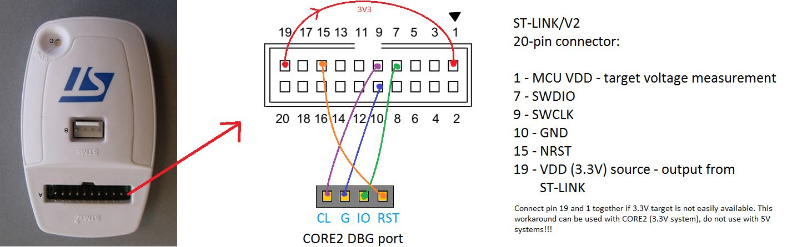

# Pre requiriments
sudo apt update
sudo apt install gcc-arm-none-eabi -y
sudo apt install gcc-arm-linux-gnueabihf -y
sudo apt install gcc-aarch64-linux-gnu -y

## STlink Connection with bluepill

# Utils for debug 
    arm-none-eabi-readelf -S build/dsp
    ls -lh build/dsp.bin

# References: 
- https://learn.arm.com/install-guides/gcc/cross/
- https://github.com/stlink-org/stlink?tab=readme-ov-file
- https://github.com/kxygk/bluepill
- https://github.com/ObKo/stm32-cmake